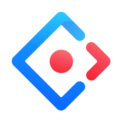
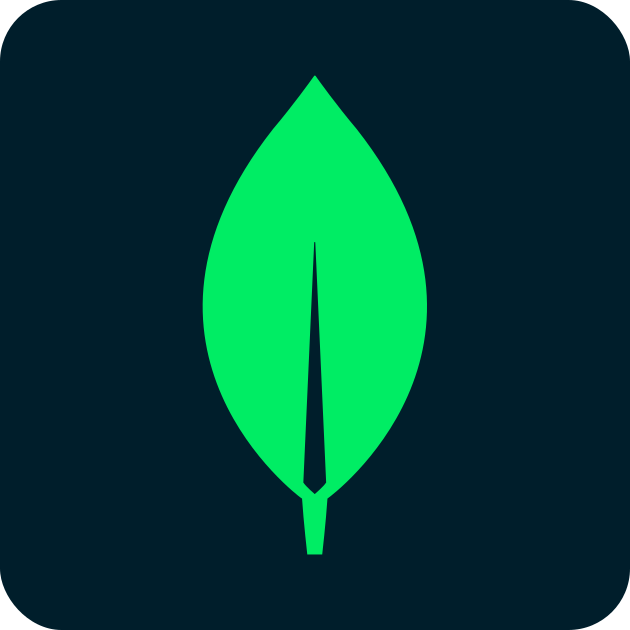
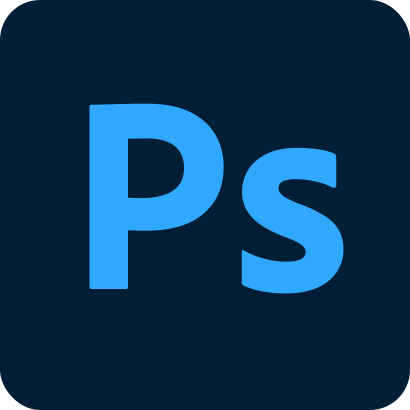
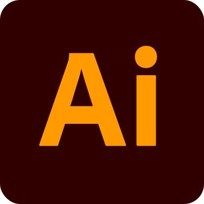

# Pierre LHOSTE
> A responsible and passionate French creator and collector

## My networks

      

<!--  -->

## My development Environment

`Languages`

   

`Frameworks`

      

`Libraries`

`Tools`

         

---
*README under construction*